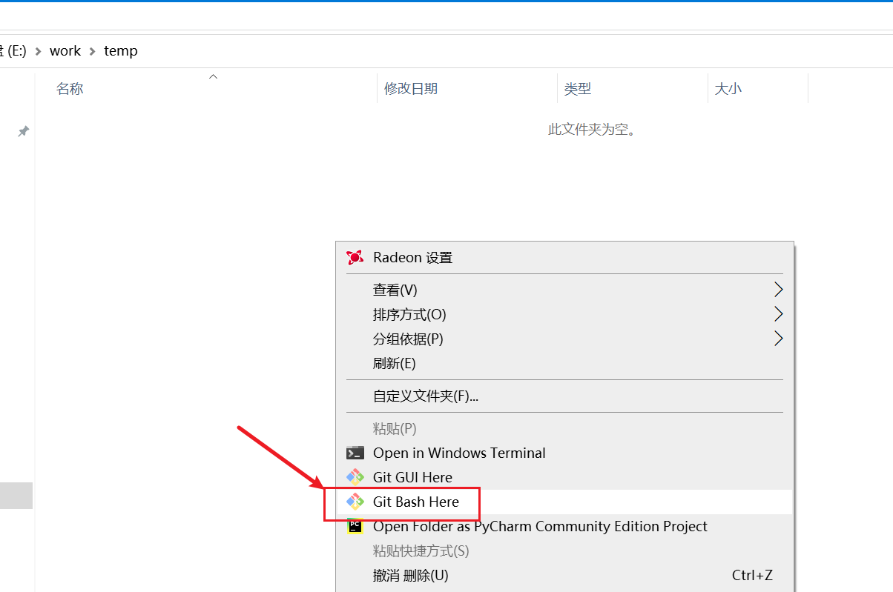

## 参与贡献
知识共享许可协议
您可以自由地：

分享 — 在任何媒介以任何形式复制、发行本文档。

演绎 — 修改、转换或以本文档为基础进行创作。

只要你遵守许可协议条款，许可人就无法收回你的这些权利。

惟须遵守下列条件：

署名 — 您必须提供适当的证书，提供一个链接到许可证，并指示是否作出更改。您可以以任何合理的方式这样做，但不是以任何方式表明，许可方赞同您或您的使用。

非商业性使用 — 您不得将本文档用于商业目的。

相同方式共享 — 如果您的修改、转换，或以本文档为基础进行创作，仅得依本素材的授权条款来散布您的贡献作品。

没有附加限制 — 您不能增设法律条款或科技措施，来限制别人依授权条款本已许可的作为。

声明：

当您使用本素材中属于公众领域的元素，或当法律有例外或限制条款允许您的使用，则您不需要遵守本授权条款。

未提供保证。本授权条款未必能完全提供您预期用途所需要的所有许可。例如：形象权、隐私权、著作人格权等其他权利，可能限制您如何使用本素材。

## 文档写作规范
Quecpython 欢迎开发者参与到开源社区的贡献中来，本文主要介绍参与Quecpython文档贡献的写作规范，如果贡献者提交文档的修改或提交新的文档，请参照此规范。


待补充


## 使用git拉取代码

我们使用的是[github](https://github.com/)提交存储代码, 首先需要安装[git](https://git-scm.com/)，
不过官网的下载速度比较感人，建议到[淘宝-git镜像库](https://npm.taobao.org/mirrors/git-for-windows/)下载最新git客户端，
更多关于git的使用可以参考[廖雪峰的Git教程](https://www.liaoxuefeng.com/wiki/896043488029600/)

到这里，认为你已经可以安装好了git

### 拉取代码

1. 打开git-bash

随便找一个空白文件夹，比如说**E:\work\temp**,然后右键打开git-bash。

- 

打开交互界面以后，就可以拉取代码了。

- **拉取develop分支的代码**

```bash
$ git clone -b develop https://github.com/quecpython/Community-document
$ cd Community-document
# 查看当前分支
$ git branch
* develop

```

### 修改文档

**当前本地其他分支的情况下， 基于develop 新建一个分支，开始修改代码。**

确认当前位于develop分支

```bash
$ git branch
* develop
# 同步当前最新的develop 代码
$ git pull origin develop
# 切换一个新得分支修改文档,比如说 write_doc
$ git checkout -b write_doc
# 修改文档以后，使用git commit 提交注释
$ git push origin write_doc
```

**当前本地包含了其他已修改的分支的情况下，使用rebase继续开发**

```bash
$ git branch
* develop
# 同步当前最新的develop 代码
$ git pull origin develop
# 假设当前本地包含有一个昨天修改过的分支 write_doc,切换到write_doc分支
$ git checkout write_doc
# 将 write_doc 分支 rebase 到 develop 分支
$ git rebase develop
# 然后就可以继续开发了
```


## teedoc 部署& 预览

```

```


## quick start

### 新建一个md文件，然后添加内容

下面我们演示一下，怎样在FAQ文件夹下面新增一篇文章。

1. **同步代码**

```bash
git pull origin develop
```

2. **在docs/zh 新建文件夹 以及 md文件**

在docs/zh 中新建others 文件夹

然后新建一个 md文件命名为 others.md


然后我们可以使用[Typora — a markdown editor, markdown reader.](https://www.typora.io/)  软件打开，修改编辑文档。


3. **修改侧边栏目录 sidebar.yaml 文件**

   

然后修改sidebar.yaml 文件， 添加下面两句

```
  - label: 其他问题
    file: others/others.md
```


修改完成以后，建议参考  本文 teedoc 部署& 预览 章节，测试查看效果。


