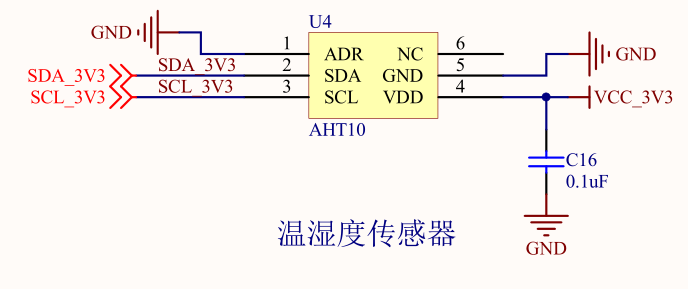

## 内部温湿度传感器实验 

本片文章主要基于 EC600S 板载温湿度传感器AHT10，做一个温湿度检测的小实验。

### 硬件资源


AHT10是一款高精度，完全校准，贴片封装的温湿度传感器，MEMS的制作工艺，确保产品具有极高的可靠性与卓越的长期稳定性。传感器包括一个电容式感湿元件和一个高性能CMOS微处理器相连接。该产品具有品质卓越、超快响应、抗干扰能力强、性价比极高等优点。具体可以参考[aht10产品手册 a220201221.pdf](http://www.aosong.com/userfiles/files/media/AHT10%E4%BA%A7%E5%93%81%E6%89%8B%E5%86%8C%20A2%2020201221.pdf)。

AHT10 通过I2C 接口通讯。按照说明书的简介。只需要按照下面的方式，发送数据就可以获取数据了。

1.  上电等待校准数据。 发送 0xE1 0x08 0x00 。 （只需要校准一次就可以）

2.  触发测量，发送 0xAC, 0x33， 0x00 . 即可。

3.  读取数据， 等待70ms 转换。 读取6字节即可。



查看原理图和数据手册 可以确定从机地址为 0x38

### 实验记录

由于是板载的模块，不需要其他外部模块。

### 实验设计

1.  初始化AHT10 传感器
2.  触发测量
3.  延时70ms
4.  读取数据
5.  转换温湿度
6.  持续第2步

### 实验代码

```python
'''

File: i2c_aht10.py

Project: i2c

File Created: Monday, 28th December 2020 5:17:28 pm

Author: chengzhu.zhou

-----

Last Modified: Tuesday, 29th December 2020 9:01:35 pm

Modified By: chengzhu.zhou

-----

Copyright 2020 - 2020 quectel

'''

import log

from machine import I2C

import utime as time

"""

1. calibration

2. Trigger measurement

3. read data

"""

# API 手册 http://qpy.quectel.com/wiki/#/zh-cn/api/?id=i2c

# AHT10 说明书

# https://server4.eca.ir/eshop/AHT10/Aosong_AHT10_en_draft_0c.pdf


class aht10class():

	i2c_log = None

	i2c_dev = None

	i2c_addre = None


 	# Initialization command

	 AHT10_CALIBRATION_CMD = 0xE1

 	# Trigger measurement

	AHT10_START_MEASURMENT_CMD = 0xAC

	# reset

	AHT10_RESET_CMD = 0xBA


	def write_data(self, data):

		self.i2c_dev.write(self.i2c_addre,

											bytearray(0x00), 0,

											bytearray(data), len(data))

		pass


def read_data(self, length):

	r_data = [0x00 for i in range(length)]

	r_data = bytearray(r_data)

	self.i2c_dev.read(self.i2c_addre,

										bytearray(0x00), 0,

										r_data, length,0)

	return list(r_data)


def aht10_init(self, addre=0x38, Alise="Ath10"):

	self.i2c_log = log.getLogger(Alise)

	self.i2c_dev = I2C(I2C.I2C1, I2C.STANDARD_MODE) # 返回i2c对象

	self.i2c_addre = addre

	self.sensor_init()

	pass


def aht10_transformation_temperature(self, data):

	r_data = data

 	# 根据数据手册的描述来转化温度

	humidity = (r_data[0] << 12) | (

		r_data[1] << 4) | ((r_data[2] & 0xF0) >> 4)

	humidity = (humidity/(1 << 20)) * 100.0

	print("current humidity is {0}%".format(humidity))

	temperature = ((r_data[2] & 0xf) << 16) | (

		r_data[3] << 8) | r_data[4]

	temperature = (temperature * 200.0 / (1 << 20)) - 50

	print("current temperature is {0}°C".format(temperature))


def sensor_init(self):

 	# calibration

	self.write_data([self.AHT10_CALIBRATION_CMD, 0x08, 0x00])

	time.sleep_ms(300) # at last 300ms

	pass


def ath10_reset(self):

	self.write_data([self.AHT10_RESET_CMD])

	time.sleep_ms(20) # at last 20ms


def Trigger_measurement(self):

 	# Trigger data conversion

	self.write_data([self.AHT10_START_MEASURMENT_CMD, 0x33, 0x00])

	time.sleep_ms(200) # at last delay 75ms

 	# check has success

	r_data = self.read_data(6)

 	# check bit7

	if (r_data[0] >> 7) != 0x0:

		print("Conversion has error")

	else:

		self.aht10_transformation_temperature(r_data[1:6])


def i2c_aht10_test():

	ath_dev = aht10class()

	ath_dev.aht10_init()


	 # 测试十次

	for i in range(10):

		ath_dev.Trigger_measurement()

		time.sleep(1)


if __name__ == "__main__":

		i2c_aht10_test()
```

### 配套代码

<!-- * [下载代码](code/i2c_aht10.py) -->
 <a href="zh-cn/QuecPythonTest/code/i2c_aht10.py" target="_blank">下载代码</a>